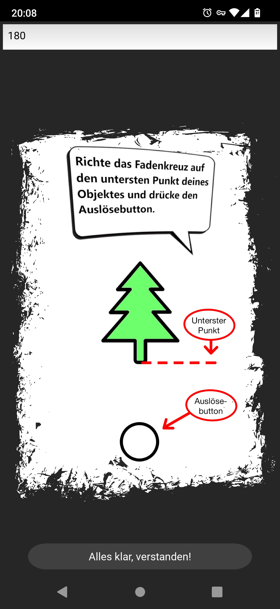
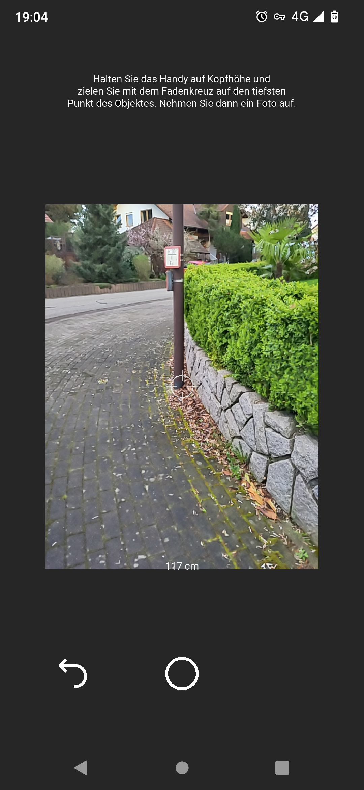
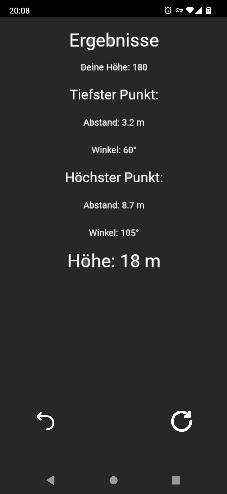
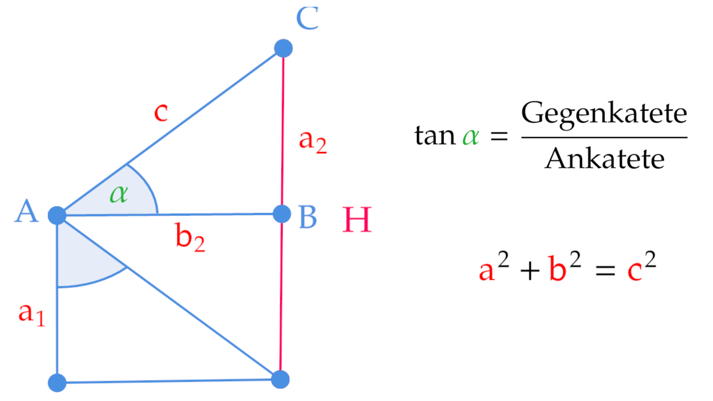

<!-- _paginate: false -->
<!-- _footer: 'Jonas Geiger, Marcel Pfaff und Sascha Schrempp' -->

# MeasureMika

Höhenmessung mit App
<!-- Powereinstieg  -->

---

# Anforderungen

- Höhenmessung
- Kamera
- Neigungssensoren

---

# Was ist MeasureMika, grobe Funktionsweise

---

<!-- _backgroundColor: #222222-->

<!-- _footer: '' -->
<!-- _paginate: false -->

---

# Innere Logik

## Aufbau und Klassen

---

### MeasureMikaApp()

- Hauptklasse
- Permissions
- Initialisiert Unterklassen

---

### MainWindow()

- Eingabe der Größe
- CheckData()
- Anleitung
- Button

---

### SecondWindow()

- Kamera
- Tiefster Punkt
- Buttons zur Navigation
- Anwendungstipps
- Index
- Live Abstand

---

### SecondWindow()

- Kamera
- Höchster Punkt

---

### ThirdWindow()

- Ergebnis Ansicht
- Ergebnis Speichern
(not implemented)

---

# Berechnen der Distanz

---

---

---

# Berechnen der Höhe

---

<!-- _footer: '' -->
<!-- _paginate: false -->

---

<!-- _footer: '' -->
<!-- _paginate: false -->

---

# Danke für Eure Aufmerksamkeit

